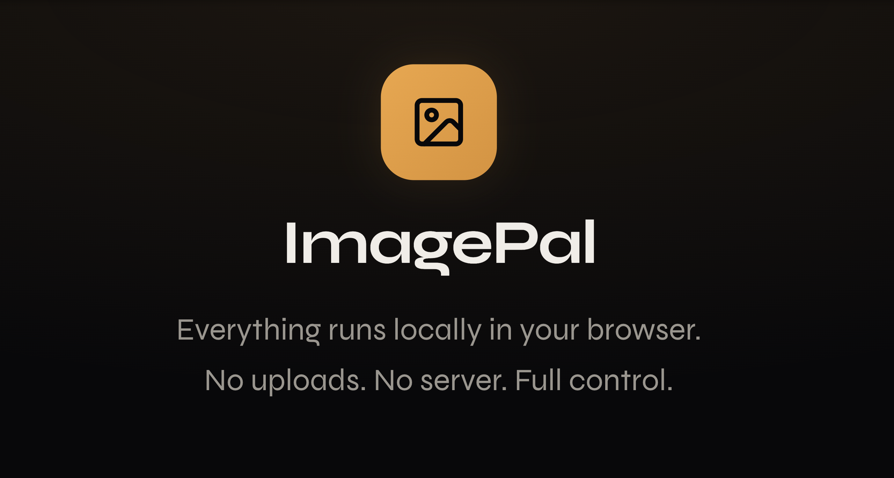

# ImagePal — Local-First Image Editor

ImagePal is a powerful, sleek, and privacy-focused web-based image editor. Built with Next.js and Syne typography, it provides a premium editing experience directly in your browser. All image processing happens locally on your device, ensuring your data never leaves your machine.



## ✨ Features

- **🚀 Local-First Processing**: Fast and secure. No servers involved in your editing flow.
- **🎨 Comprehensive Tools**: Crop, Resize, Compress, and Format Conversion.
- **🌈 Advanced Adjustments**: Filters, Hue/Saturation, Curves, and more.
- **📦 Layer Support**: Manage complex edits with a professional layer system.
- **⚡ Performance Driven**: Built with Next.js 16 and optimized for speed.
- **📱 Responsive Design**: Edit on your desktop or tablet with a seamless UI.

## 🛠 Tech Stack

- **Framework**: [Next.js 16](https://nextjs.org/) (App Router)
- **Styling**: [Tailwind CSS 4](https://tailwindcss.com/)
- **Animations**: [Framer Motion](https://www.framer.com/motion/)
- **Icons**: [Lucide React](https://lucide.dev/)
- **Typography**: [Syne](https://fonts.google.com/specimen/Syne)

## 🚀 Getting Started

### Prerequisites

- Node.js 18+ 
- pnpm (recommended)

### Installation

1. Clone the repository:
   ```bash
   git clone https://github.com/musamusakannike/imagepal.git
   cd imagepal
   ```

2. Install dependencies:
   ```bash
   pnpm install
   ```

3. Run the development server:
   ```bash
   pnpm dev
   ```

4. Open [http://localhost:3000](http://localhost:3000) with your browser.

## 📄 License

Distributed under the MIT License. See `LICENSE` for more information.

## 🤝 Contributing

Contributions are what make the open source community such an amazing place to learn, inspire, and create. Any contributions you make are **greatly appreciated**.

1. Fork the Project
2. Create your Feature Branch (`git checkout -b feature/AmazingFeature`)
3. Commit your Changes (`git commit -m 'Add some AmazingFeature'`)
4. Push to the Branch (`git push origin feature/AmazingFeature`)
5. Open a Pull Request

---

Built with ❤️ by [Musa Musakannike](https://github.com/musamusakannike)
